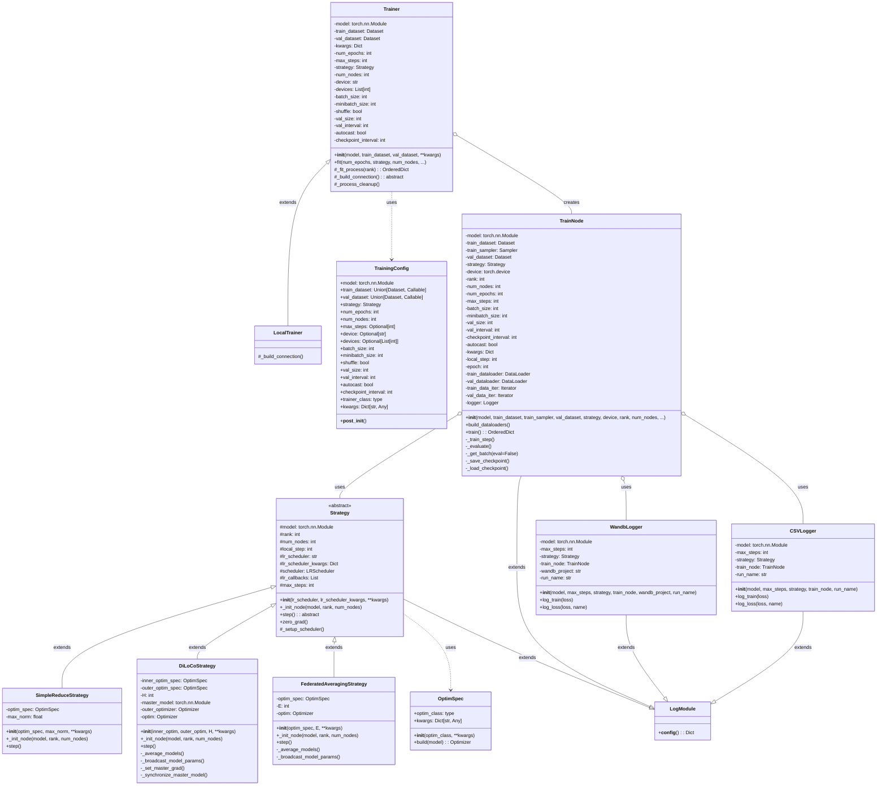

# ExoGym: Technical Documentation

## Table of Contents

1. [Introduction](#1-introduction)
2. [System Architecture](#2-system-architecture)
   1. [High-Level Architecture](#21-high-level-architecture)
   2. [Key Components](#22-key-components)
3. [Detailed Component Analysis](#3-detailed-component-analysis)
   1. [Trainer and LocalTrainer](#31-trainer-and-localtrainer)
   2. [TrainNode](#32-trainnode)
   3. [Strategy Hierarchy](#33-strategy-hierarchy)
   4. [Multiprocessing and Communication](#34-multiprocessing-and-communication)
4. [Execution Flow](#4-execution-flow)
   1. [Training Process Flow](#41-training-process-flow)
   2. [Strategy Execution Flow](#42-strategy-execution-flow)
5. [Dataset Handling](#5-dataset-handling)
6. [Optimization Strategies](#6-optimization-strategies)
   1. [SimpleReduceStrategy (DDP)](#61-simplereducestrategy-ddp)
   2. [DiLoCoStrategy](#62-dilocostrategy)
   3. [FedAvg](#63-fedavg)
   4. [SPARTA](#64-sparta)
7. [Implementation Details](#7-implementation-details)
   1. [Communication Primitives](#71-communication-primitives)
   2. [Optimizer Specification](#72-optimizer-specification)
   3. [Logging](#73-logging)
8. [Usage Examples](#8-usage-examples)
9. [Conclusion](#9-conclusion)

## 1. Introduction

ExoGym is an open-source framework designed to simulate distributed training methods on a single machine. Instead of requiring multiple physical machines or GPUs for distributed training, ExoGym creates a simulated distributed environment using multiple processes on a single machine. This document provides a detailed technical explanation of the ExoGym codebase, its architecture, and how it works.

The framework supports various distributed training methods including:
- AllReduce (equivalent to PyTorch DDP)
- FedAvg (Federated Averaging)
- DiLoCo (Distributed Local Contrastive)
- SPARTA
- DeMo

ExoGym is particularly useful for researchers and developers who want to experiment with distributed training methods without the need for expensive hardware setups.

## 2. System Architecture

### 2.1 High-Level Architecture

ExoGym follows a modular architecture with clear separation of concerns:



### 2.2 Key Components

1. **Trainer**: The main entry point for training, responsible for setting up the distributed environment and managing the training process.
2. **TrainNode**: Represents a single node in the distributed training process, running its own training loop.
3. **Strategy**: Abstract class defining the interface for optimization and communication strategies.
4. **Various Strategy Implementations**: Different distributed training algorithms implemented as Strategy subclasses.
5. **Logger**: Classes for logging training progress and metrics.
6. **OptimSpec**: Utility class for specifying optimizers.

## 3. Detailed Component Analysis

### 3.1 Trainer and LocalTrainer

#### 3.1.1 Trainer Class

The `Trainer` class is the main entry point for training. It's responsible for:
- Holding the model and datasets
- Setting up the distributed environment
- Creating and managing TrainNode instances
- Collecting and averaging results from multiple nodes

```python
class Trainer:
    def __init__(self, 
                model: torch.nn.Module,
                train_dataset: Union[torch.utils.data.Dataset, Callable],
                val_dataset: Union[torch.utils.data.Dataset, Callable],
                **kwargs):
        self.model = model
        self.train_dataset = train_dataset
        self.val_dataset = val_dataset
        self.kwargs = kwargs
        
    def fit(self,
            num_epochs: int,
            strategy: Strategy,
            num_nodes: int,
            max_steps: int = None,
            device: str = None,
            devices: list[int] = None,
            batch_size: int = 16,
            minibatch_size: int = 16,
            shuffle: bool = True,
            val_size: int = 64,
            val_interval: int = 100,
            autocast: bool = False,
            checkpoint_interval: int = 100,
            **kwargs):
        # Store parameters
        self.num_epochs = num_epochs
        self.max_steps = max_steps
        self.strategy = strategy
        self.num_nodes = num_nodes
        # ... (store other parameters)
        
        if num_nodes == 1:
            # Single process mode - run directly
            final_state_dict = self._fit_process(rank=0)
            # Create final model with trained weights
            final_model = copy.deepcopy(self.model)
            final_model.load_state_dict(final_state_dict)
            return final_model
        else:
            # Multi-process mode - use safe launcher
            config = TrainingConfig(
                model=self.model,
                train_dataset=self.train_dataset,
                val_dataset=self.val_dataset,
                strategy=strategy,
                # ... (other parameters)
            )
            averaged_state_dict = launch(config)
            
            # Create final model with averaged weights
            final_model = copy.deepcopy(self.model)
            final_model.load_state_dict(averaged_state_dict)
            return final_model
```

The `_fit_process` method is the core training logic that runs in each process:

```python
def _fit_process(self, rank):
    self.rank = rank
    
    # Set up distributed communication
    self._build_connection()
    
    # Move model to device and initialize strategy
    self.model = copy.deepcopy(self.model).to(self.device)
    self.strategy = copy.deepcopy(self.strategy)
    self.strategy._init_node(self.model, self.rank, self.num_nodes)
    
    # Handle dataset distribution
    if callable(self.train_dataset):
        # For dataset factory, no distributed sampler needed
        self.sampler = None
    else:
        # For direct dataset, use DistributedSampler
        self.sampler = torch.utils.data.DistributedSampler(
            self.train_dataset, 
            num_replicas=self.num_nodes, 
            rank=self.rank, 
            shuffle=self.shuffle
        )
    
    # Create and run TrainNode
    sim = TrainNode(
        self.model,
        self.train_dataset,
        self.sampler,
        self.val_dataset,
        self.strategy,
        self.device,
        self.rank,
        self.num_nodes,
        # ... (other parameters)
    )
    
    final_state_dict = sim.train()
    
    # Clean up
    self._process_cleanup()
    
    return final_state_dict
```

#### 3.1.2 LocalTrainer Class

The `LocalTrainer` extends `Trainer` and implements the `_build_connection` method to set up PyTorch distributed communication:

```python
class LocalTrainer(Trainer):
    def _build_connection(self):
        '''
        This is the default callback for setting up pytorch distributed connections.
        All ranks are assumed to be on the same machine, and device is defaulted to cpu.
        '''
        os.environ['MASTER_ADDR'] = 'localhost'
        
        # Set up port for communication
        if self.kwargs.get('port', None) is not None:
            os.environ['MASTER_PORT'] = str(self.kwargs['port'])
        else:
            os.environ['MASTER_PORT'] = str(12355 + (10 if self.device == 'cpu' else 0))
        
        # Auto-detect device if not specified
        if self.device == '' or self.device == None:
            if torch.cuda.is_available():
                self.device = 'cuda'
            elif torch.backends.mps.is_available():
                self.device = 'mps' 
            else:
                self.device = 'cpu'
        
        # Initialize the process group based on device
        if self.device == 'cuda':
            # If we haven't specified devices, use all devices.
            if self.devices is None:
                self.devices = range(torch.cuda.device_count())
            
            # Use NCCL backend if we have enough GPUs, otherwise use gloo
            dist.init_process_group(
                "nccl" if len(self.devices) == self.num_nodes else "gloo", 
                rank=self.rank, 
                world_size=self.num_nodes
            )
            self.device = torch.device(f"cuda:{self.devices[self.rank % len(self.devices)]}")
            torch.cuda.set_device(self.device)
        elif self.device == 'cpu':
            dist.init_process_group("gloo", rank=self.rank, world_size=self.num_nodes)
            self.device = torch.device("cpu")
        elif self.device == 'mps':
            dist.init_process_group("gloo", rank=self.rank, world_size=self.num_nodes)
            self.device = torch.device("mps")
        else:
            raise ValueError(f"Invalid device type: {self.device}")
        
        print(f"Rank {self.rank} using device {self.device}")
```

### 3.2 TrainNode

The `TrainNode` class represents a single node in the distributed training process:

```python
class TrainNode(LogModule):
    def __init__(self, 
                model: torch.nn.Module,
                train_dataset: Union[torch.utils.data.Dataset, Callable],
                train_sampler: torch.utils.data.Sampler,
                val_dataset: Union[torch.utils.data.Dataset, Callable],
                strategy: Strategy,
                device: torch.device,
                rank: int,
                num_nodes: int,
                num_epochs: int,
                max_steps: int = None,
                batch_size: int = 16, 
                minibatch_size: int = 16,
                val_size: int = 64, 
                val_interval: int = 100,
                checkpoint_interval: int = 100,
                autocast: bool = False,
                **kwargs):
        # Store parameters
        self.model = model
        
        # Handle dataset factory vs direct dataset for training
        if callable(train_dataset):
            # Call the dataset factory function with rank, num_nodes, and val=False
            self.train_dataset = train_dataset(rank, num_nodes, False)
            # When using dataset factory, we don't need a distributed sampler
            self.train_sampler = None
        else:
            # Use the dataset directly as before
            self.train_dataset = train_dataset
            self.train_sampler = train_sampler
        
        # Handle dataset factory vs direct dataset for validation
        if callable(val_dataset):
            # Call the dataset factory function with rank, num_nodes, and val=True
            self.val_dataset = val_dataset(rank, num_nodes, True)
        else:
            # Use the dataset directly as before
            self.val_dataset = val_dataset
        
        # Store other parameters
        self.strategy = strategy
        self.device = device
        self.rank = rank
        self.num_nodes = num_nodes
        self.num_epochs = num_epochs
        self.max_steps = max_steps
        self.batch_size = batch_size
        self.minibatch_size = minibatch_size
        self.val_size = val_size
        self.val_interval = val_interval
        self.autocast = autocast
        self.checkpoint_interval = checkpoint_interval
        self.kwargs = kwargs
        
        # Build dataloaders
        self.build_dataloaders()
        
        # Set random seed for reproducibility
        seed = 42
        torch.manual_seed(seed)
        torch.cuda.manual_seed(seed)
        
        # Ensure all process models share the same initial parameters
        if self.num_nodes > 1:
            for _, param in self.model.named_parameters():
                broadcast(param.data, src=0)
        
        # Initialize step counters
        self.local_step = 0
        self.epoch = 0
        
        # Attempt to load checkpoint before starting training
        self._load_checkpoint()
```

The `build_dataloaders` method creates DataLoaders for training and validation:

```python
def build_dataloaders(self):
    """
    Builds dataloaders.
    """
    # For dataset factory case (when sampler is None), we can enable shuffling
    # For regular dataset case (when sampler is provided), shuffling is handled by the sampler
    self.train_dataloader = DataLoader(
        self.train_dataset, 
        batch_size=self.minibatch_size,
        sampler=self.train_sampler,
        shuffle=(self.train_sampler is None)
    )

    self.val_dataloader = DataLoader(
        self.val_dataset, 
        batch_size=self.minibatch_size,
        shuffle=True
    )

    self.train_data_iter = iter(self.train_dataloader)
    self.val_data_iter = iter(self.val_dataloader)
```

The `train` method is the main training loop:

```python
def train(self):
    # Set up maximum steps if not provided
    if self.max_steps is None:
        self.max_steps = self.num_epochs * len(self.train_dataloader) / (self.batch_size // self.minibatch_size)
    
    # Inform strategy of max_steps
    self.strategy.max_steps = self.max_steps
    
    # Set up logger for rank 0
    if self.rank == 0:
        if self.kwargs.get('wandb_project', None) is not None:
            self.logger = WandbLogger(
                model=self.model, 
                max_steps=self.max_steps,
                strategy=self.strategy,
                train_node=self,
                wandb_project=self.kwargs.get('wandb_project', None),
                run_name=self.kwargs.get('run_name', None)
            )
        else:
            self.logger = CSVLogger(
                model=self.model, 
                max_steps=self.max_steps,
                strategy=self.strategy,
                train_node=self,
                run_name=self.kwargs.get('run_name', None)
            )
    
    # Main training loop
    while self.local_step < self.max_steps:
        # Training step
        self._train_step()
        
        # Periodically evaluate
        if self.local_step % self.val_interval == 0:
            self._evaluate()
        
        # Increment step counter
        self.local_step += 1
    
    # Return final model state
    return self.model.state_dict()
```

The `_train_step` method performs a single training step:

```python
def _train_step(self):
    # Zero gradients
    self.strategy.zero_grad()
    
    # Process multiple minibatches to form a batch
    for i in range(self.batch_size // self.minibatch_size):
        # Get minibatch
        minibatch = self._get_batch()
        
        # Forward pass with optional mixed precision
        if self.autocast:
            with torch.autocast(device_type=self.device, dtype=torch.bfloat16):
                loss = self.model(minibatch)
        else:
            loss = self.model(minibatch)
        
        # Backward pass
        loss.backward()
    
    # Normalize gradients by number of minibatches
    for name, param in self.model.named_parameters():
        if param.requires_grad:
            param.grad /= (self.batch_size / self.minibatch_size)
    
    # Update weights using strategy
    self.strategy.step()
    
    # Log training loss for rank 0
    if self.rank == 0:
        self.logger.log_train(loss=loss.item())
    
    # Save checkpoint if needed
    if self.checkpoint_interval and self.local_step % self.checkpoint_interval == 0:
        self._save_checkpoint()
```

The `_evaluate` method evaluates the model on the validation dataset:

```python
def _evaluate(self):
    if self.val_size == 0:
        return

    # Create a copy of the model for evaluation
    model_clone = copy.deepcopy(self.model)

    # Average model parameters across all nodes
    for name, param in model_clone.named_parameters():
        all_reduce(param.data, op=dist.ReduceOp.SUM)
        param.data = param.data / dist.get_world_size()

    # Rank 0 evaluates the local model
    if self.rank == 0:
        this_model = self.model

    # Rank 1 evaluates the averaged model
    if self.rank == 1:
        this_model = model_clone

    # Evaluation logic for ranks 0 and 1
    if self.rank == 0 or self.rank == 1:
        this_model.eval()
        
        loss_total = 0

        with torch.no_grad():
            for _ in range(int(self.val_size / self.batch_size)):
                for i in range(self.batch_size // self.minibatch_size):
                    minibatch = self._get_batch(eval=True)

                    if self.autocast:
                        with torch.autocast(device_type=self.device, dtype=torch.bfloat16):
                            loss = this_model(minibatch)
                    else:
                        loss = this_model(minibatch)

                    loss_total += loss.item() / (self.batch_size // self.minibatch_size)

    # Rank 0 logs the local evaluation
    if self.rank == 0:
        self.logger.log_loss(
            loss=loss_total / int(self.val_size / self.batch_size), 
            name='local'
        )

    # Broadcast the global loss from rank 1 to all ranks
    if self.num_nodes > 1:
        # All ranks create a dummy tensor to participate
        global_loss_tensor = torch.empty(1, device=next(self.model.parameters()).device)
        if self.rank == 1:
            global_loss_tensor[0] = loss_total / int(self.val_size / self.batch_size)
        broadcast(global_loss_tensor, src=1)

        # Only rank 0 logs the global evaluation
        if self.rank == 0:
            global_loss = global_loss_tensor.item()
            self.logger.log_loss(loss=global_loss, name='global')

    del model_clone
```

### 3.3 Strategy Hierarchy

#### 3.3.1 Strategy Base Class

The `Strategy` abstract class defines the interface for optimization strategies:

```python
class Strategy(ABC, LogModule):
    def __init__(self,
                lr_scheduler: str = None,
                lr_scheduler_kwargs: Dict[str, Any] = None,
                **kwargs: Dict[str, Any]):
        # Store parameters
        self.lr_scheduler = lr_scheduler
        self.lr_scheduler_kwargs = lr_scheduler_kwargs
        self.kwargs = kwargs
        
        # Set attributes from kwargs
        for k, v in kwargs.items():
            setattr(self, k, v)
        
        # Initialize scheduler as None; will be set after self.optim is defined in subclasses
        self.scheduler = None
        
        # List of callbacks to record learning rate changes
        self.lr_callbacks = []
        
        # Initialize max_steps
        self.max_steps = 1  # Needs to be initialized for first call of lr_lambda
    
    def _init_node(self, model, rank, num_nodes):
        # Store model and node information
        self.model = model
        self.rank = rank
        self.num_nodes = num_nodes
        
        # Initialize step counter
        self.local_step = 0
    
    @abstractmethod
    def step(self):
        # Reset communication bytes counter
        self.nbytes = 0
        
        # Update learning rate if scheduler is defined
        if self.scheduler is not None:
            self.scheduler.step()
            
            # Call callbacks for rank 0
            if self.rank == 0:
                for callback in self.lr_callbacks:
                    callback(self.scheduler.get_last_lr()[0])
        
        # Increment step counter
        self.local_step += 1
    
    def zero_grad(self):
        # Zero gradients
        self.optim.zero_grad()
    
    def _setup_scheduler(self):
        # Define learning rate schedule function
        def lr_lambda(current_step):
            warmup_steps = self.lr_scheduler_kwargs.get('warmup_steps', 1)
            # If max steps not set, 
            if 'max_steps' in self.lr_scheduler_kwargs:
                max_steps = min(self.lr_scheduler_kwargs['max_steps'], self.max_steps)
            else:
                max_steps = self.max_steps
            cosine_anneal = self.lr_scheduler_kwargs.get('cosine_anneal', False)
            
            # Linear warmup
            if current_step < warmup_steps:
                return float(current_step) / float(max(warmup_steps, 1))
            # Cosine annealing
            elif cosine_anneal:
                min_lr_factor = 0.1
                progress = (current_step - warmup_steps) / float(
                    max(1, max_steps - warmup_steps)
                )
                cosine_term = 0.5 * (1.0 + math.cos(math.pi * progress))
                return (1 - min_lr_factor) * cosine_term + min_lr_factor
            # Constant learning rate
            else:
                return 1.0
        
        # Create scheduler based on type
        if self.lr_scheduler == 'lambda_cosine':
            self.scheduler = LambdaLR(self.optim, lr_lambda)
        elif self.lr_scheduler is not None:
            lr_sched_kwargs = (self.lr_scheduler_kwargs 
                              if self.lr_scheduler_kwargs is not None else {})
            self.scheduler = self.lr_scheduler(self.optim, **lr_sched_kwargs)
        else:
            self.scheduler = None
```

#### 3.3.2 SimpleReduceStrategy

The `SimpleReduceStrategy` implements the standard distributed data parallel (DDP) approach:

```python
class SimpleReduceStrategy(Strategy):
    def __init__(self, 
                optim_spec=None,
                max_norm=None,
                **kwargs):
        super().__init__(**kwargs)
        
        # Set optimizer specification
        self.optim_spec = ensure_optim_spec(optim_spec) or OptimSpec(torch.optim.AdamW)
        
        # Set gradient clipping norm
        self.max_norm = max_norm
    
    def _init_node(self, model, rank, num_nodes):
        # Initialize base class
        super()._init_node(model, rank, num_nodes)
        
        # Create optimizer
        self.optim = self.optim_spec.build(model)
        
        # Set up learning rate scheduler
        self._setup_scheduler()
    
    def step(self):
        # Average gradients across all nodes
        if self.num_nodes > 1 or True:
            for param in self.model.parameters():
                if param.grad is not None:
                    # All-reduce operation to average gradients
                    all_reduce(param.grad)
                    param.grad.div_(self.num_nodes)
            
            # Apply gradient clipping if needed
            if self.max_norm:
                nn_utils.clip_grad_norm_(self.model.parameters(), max_norm=self.max_norm)
        
        # Update weights
        self.optim.step()
        
        # Call base class step to update counters and scheduler
        super().step()
```

#### 3.3.3 DiLoCoStrategy

The `DiLoCoStrategy` implements the Distributed Local Contrastive (DiLoCo) approach:

```python
class DiLoCoStrategy(Strategy):
    def __init__(self, 
                inner_optim: Optional[Union[str, OptimSpec]] = None,
                outer_optim: Optional[Union[str, OptimSpec]] = None,
                H: int = 100,
                **kwargs):
        # Set inner optimizer specification (for local updates)
        self.inner_optim_spec = ensure_optim_spec(inner_optim, 
            OptimSpec(torch.optim.AdamW)
        )
        
        # Set outer optimizer specification (for global updates)
        self.outer_optim_spec = ensure_optim_spec(outer_optim, OptimSpec(
            torch.optim.SGD,
            lr=0.7,
            nesterov=True,
            momentum=0.9